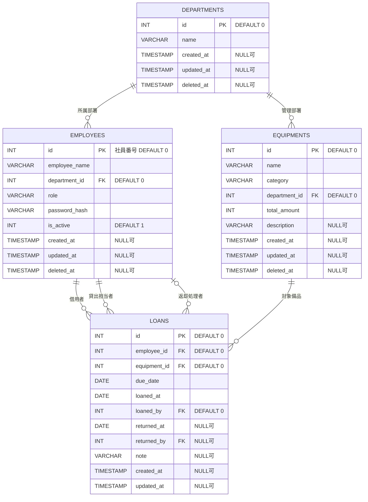

# Codex設計指示

- このファイルは、本案件の要件・設計とUI画像参照を集約した設計正本である。ルート`README.md`は別用途の環境構築資料であり、本ファイルとは同期しない。
- 調査、設計、実装、レビュー、テストの前に、このファイルを最初から最後まで読むこと。
- UIを扱う場合は、画面IDに対応するリポジトリ内の[`.codex/ui_image/`](ui_image/)配下の画像も確認すること。
- 設計変更はこのファイルへ反映する。UI画像変更時は`.codex/ui_image/`配下の対応ファイルを更新し、ルート`README.md`やルート`ui_image/`への同期を前提としない。
- 既存のDocker、Composer、FuelPHP、DBおよび環境別configを現行実装として優先する。本ファイルとの不一致は本ファイル側を修正し、ユーザーから明示的な変更指示がない限り設定ファイルを変更しない。
- 既存セクションタイトルを変更しないこと。セクション追加は認める。
- `## 開発スケジュール`と`## 開発条件`の内容を変更しないこと。

---

# Title
社内備品の管理アプリ

> 文書種別: 基本設計書兼詳細設計書  
> 設計基準日: 2026-07-25  
> 対象: 初回リリース（MVP）  
> 正本: 本ファイル（`.codex/AGENTS.md`）を本案件の要件・設計の正本とする。

## 開発概要
社内備品の管理と貸出を行うアプリの作成

### 目的

社内備品を部署別・種類別の数量で管理し、「何が」「どの部署に何個あり」「何個を貸し出せるか」を確認できる状態にする。管理者による貸出登録と返却処理を同じWebアプリで扱い、社員は自分の貸出状況と返却期限を参照する。

### 対象利用者

| 利用者 | 説明 |
| --- | --- |
| 備品管理者（以下「管理者」） | 社員・部署・備品在庫を管理し、借用者と備品を指定して貸出を直接登録し、返却処理を行う。 |
| 社員 | 備品を検索し、自分の貸出状況、返却期限、返却済み履歴を参照する。貸出・返却操作は行わない。 |

### MVPの対象範囲

- 社員番号とパスワードによるログイン・ログアウト
- 部署、社員、備品在庫のCRUD
- 備品の検索、詳細表示、管理者による貸出登録・返却
- 管理操作の監査ログ
- 同時操作による在庫超過・二重貸出処理・二重返却処理の防止

### MVPの対象外

- 消耗品、ロット、入出庫、使用可能期限、発注点の管理
- 破損、故障、メンテナンス、廃棄等の物品状態管理
- 製造番号、資産番号、個体別の所在・状態・貸出履歴
- 社内SSO、人事・会計システムとの連携
- CSV入出力、添付ファイル、画像アップロード
- QRコード、バーコード、RFID、物理ラベルの発行・読取
- 減価償却、購買、廃棄申請、貸出期間延長
- インターネットへの外部公開

### 成功条件

- 未削除の全備品在庫について、内部主キーID、名称、管理部署、総数、貸出中数、利用可能数を確認できる。
- 貸出中の備品について、管理者と借用者本人が返却期限を確認できる。
- 貸出登録・返却を同時実行しても、貸出中数が総数を超えない。
- 社員は管理者専用機能や他社員の貸出履歴を閲覧・操作できない。
- 本書のチェックシートと完了条件を満たす。

## 開発要件

- 社内備品を部署別・種類別に登録し、総数と利用可能数を明確にする。
- 社員は備品を検索し、自分の貸出状況と返却済み履歴を参照できる。
- 管理者だけが借用者、備品、返却期限を指定して貸出を直接登録できる。
- 管理者だけが貸出中データを返却処理できる。
- 返却期限は貸出一覧とダッシュボードの「貸出中」欄へ表示し、未返却かつ期限日を過ぎた貸出は「返却超過」と表示する。通知、期限接近の事前警告、外部送信は実装しない。
- 認証、認可、入力検証、出力エスケープ、CSRF対策、Session保護、監査ログを実装する。

### 開発要件の具体化

| ID | 要件 | 受入条件 |
| --- | --- | --- |
| BR-01 | 備品の所在と数量を明確にする。 | 部署別・種類別の備品在庫に一意な内部主キーIDと総数を保持し、利用可能数とともに一覧・詳細で確認できる。 |
| BR-02 | 備品の借用者を明確にする。 | 各貸出は借用者と1つの備品在庫を参照し、1貸出につき1個を表す。 |
| BR-03 | 返却期限を確認できるようにする。 | `returned_at IS NULL`の貸出一覧とダッシュボードへ返却期限を表示し、`due_date < Asia/Tokyoの当日`なら「返却超過」と文字タグで表示する。 |
| BR-04 | 権限外アクセスを防ぐ。 | 全業務画面を認証必須とし、ControllerとServiceで認可する。 |
| BR-05 | 履歴を追跡可能にする。 | 貸出登録、返却、権限変更の操作者と日時を監査記録する。 |
| BR-06 | 大量データに対応する。 | 1万備品在庫を想定し、一覧をサーバ側でページングする。 |

### 分類ルール

- MVPでは備品と消耗品を分類せず、登録対象を貸出可能な備品だけに限定する。
- 税込単価、想定使用期間、発注点は登録しない。
- 消耗品管理が必要になった場合は、分類、ロット、在庫移動を別要件として追加する。
- 管理部署は備品を保管・運用する部署とし、`departments`から選択する。管理部署と保管部署は分けない。
- 同じ名称の備品でも管理部署が異なれば別の備品在庫とし、異なる`equipments.id`で識別する。
- カテゴリは備品を一覧検索するための必須文字列属性とし、1備品在庫につき1つだけ登録する。システム全体では備品ごとに異なる複数のカテゴリ値を使用できる。
- カテゴリ専用のテーブル、マスタ画面、APIは作成しない。登録済み候補は未削除の`equipments.category`を重複排除して取得する。

## 機能要件

- 認証、ログアウト、パスワード変更
- 社員、部署のCRUD
- 備品在庫のCRUD
- 備品検索、詳細表示、ページング
- 管理者による貸出登録・返却
- 自分の貸出履歴、管理者向け全件確認
- 認証試行制限のローカルファイル管理
- 監査ログのファイル記録

### 機能一覧

| ID | 機能 | 主利用者 | 仕様・完了条件 |
| --- | --- | --- | --- |
| FN-AUTH-01 | ログイン | 全員 | ローカル状態ファイルで認証試行を制限し、有効な社員番号とパスワードの照合成功時にSession IDを再生成する。 |
| FN-AUTH-02 | ログアウト | 全員 | POSTで実行し、サーバ側Sessionを破棄する。 |
| FN-AUTH-03 | パスワード変更 | 全員 | 現在パスワードを確認し、本人が任意のタイミングで変更できる。 |
| FN-EMP-01 | 社員CRUD | 管理者 | 登録時にパスワードを設定し、参照、更新、利用停止、再有効化、論理削除、復元、権限変更を行う。既存の`is_active`と`deleted_at`だけを使用する。 |
| FN-EMP-02 | パスワード再設定 | 管理者 | 管理者が新しいパスワードと確認値を入力し、社員のパスワードを直接再設定する。 |
| FN-DEPT-01 | 部署CRUD | 管理者 | 部署を登録、参照、更新、論理削除、復元する。既存の`deleted_at`だけを使用する。 |
| FN-EQP-01 | 備品在庫CRUD | 管理者 | 内部主キーID、名称、カテゴリ、管理部署、総数、説明を管理する。 |
| FN-EQP-02 | 備品検索 | 全員 | キーワード、カテゴリ、管理部署、利用可能在庫の有無をAND検索し、一覧内で詳細を展開する。 |
| FN-LOAN-01 | 貸出登録 | 管理者 | 借用者、備品、返却期限を指定して`loans`へ直接登録する。1貸出は1個とする。 |
| FN-LOAN-02 | 返却 | 管理者 | 貸出中データへ返却日、返却処理者、任意の備考を記録する。 |
| FN-LOAN-03 | 貸出参照 | 管理者・本人 | 管理者は全件、社員は本人分だけを参照する。返却期限と算出状態（貸出中・返却超過・返却済）を表示する。 |
| FN-AUDIT-01 | 監査ログ | システム | 重要操作の操作者、対象、成否、日時をJSON Linesファイルへ追記する。 |

### 共通業務ルール

- 備品在庫は同一管理部署・同一名称につき1レコードとし、同じ型式・仕様は名称へ含めて区別する。
- `total_amount`だけをDBへ保持し、貸出中数と利用可能数は`loans`から算出する。
- `loans`の1行は貸出から返却まで備品1個を表し、数量入力や一部返却は扱わない。
- 貸出日から返却期限までを最大90日とする。
- `returned_at IS NULL`の件数だけが`total_amount`以下となるようにする。
- 管理者だけが貸出登録と返却を実行し、社員は貸出データを更新できない。
- 申請、取消、承認、却下、貸出前の中間状態は作らない。
- 返却期限は`DATE`型の日付だけを保存し、指定日の終了まで有効な業務日として扱う。時刻値は保存せず、貸出一覧とダッシュボードの「貸出中」欄に日付を表示する。
- 画面表示用の貸出状態はDBへ保存せず、`returned_at IS NOT NULL`なら返却済、未返却かつ`due_date < Asia/Tokyoの当日`なら返却超過、それ以外を貸出中と算出する。
- 返却後は貸出中数が1減り、利用可能数が1増える。
- 部署、社員、備品は履歴が存在する場合に物理削除しない。貸出は行を削除せず、状態遷移の履歴として保持する。

### 更新・削除ルール

- 社員番号として使用する`employees.id`は変更・再利用しない。
- 未返却貸出がある社員は利用停止できない。
- 社員の一時利用停止は`is_active = 0`、再有効化は`is_active = 1`、論理削除は`deleted_at`、復元は`deleted_at = NULL`だけで表現し、新しい状態列を追加しない。
- 最後の有効な管理者は、利用停止、論理削除、社員権限への降格をできない。再有効化と復元では所属部署が未削除であることを再検証する。
- 履歴がある備品は管理部署と名称を変更しない。部署移管は移管元の総数を減らし、移管先の備品在庫を新規作成または加算する。
- `total_amount`は貸出中数未満へ減らせない。
- 履歴がある備品は物理削除しない。未返却貸出がない場合だけ論理削除できる。
- 論理削除済みと同じ部署・名称の備品を再登録する場合は、新規行を作らず既存行を復元する。
- 社員の所属部署または備品の管理部署として参照中の部署は論理削除できない。
- 論理削除済み部署と同じ名称を登録しようとした場合は新規行を作らず、参照整合性を確認して既存部署を復元する。復元専用APIも同じService処理を使用する。
- 論理削除済みデータは通常一覧と新規取引候補から除外し、過去履歴では参照できる。
- 上記API追加では既存の`departments`、`employees`、`equipments`、`loans`の列、型、制約を変更せず、新しいマイグレーションを作成しない。

## 開発スケジュール
開発工数: 130h

- 着手日：　7/22
- 完了日：　8/19
- 要件定義：　7/22
- 設計：　7/23 ~ 7/24
- チェック：　7/25 ~ 7/27
- 実装：　7/28 ~ 8/8
- テスト：　8/9 ~ 8/10
- レビュー：　8/11 ~ 8/14
- 修正：　8/15 ~ 8/16
- バッファ：　8/17 ~

## UIイメージ
備品管理者と社員は可能な限り同じ画面、URL、レイアウトを使用する。備品一覧には総数、貸出中数、利用可能数を表示し、貸出状態は文字タグで示す。権限差は管理者だけに登録・編集・貸出登録・返却等の操作ボタンを表示することで示す。

画像はリポジトリ相対の[`.codex/ui_image/`](ui_image/)直下に、画面設計IDごとに1ファイルで配置する。この文書からのリンクは`ui_image/`を使用する。共通画面は管理者表示を代表画像とし、社員表示では本書の権限表に従って管理ボタンと追加列を取り除く。

### UI画像ファイル

| 画面ID | ページタイトル | ファイル | 表示例 |
| --- | --- | --- | --- |
| SCR-01 | ログイン | [SCR-01_login.png](ui_image/SCR-01_login.png) | 共通 |
| SCR-02 | パスワード変更 | [SCR-02_password-change.png](ui_image/SCR-02_password-change.png) | 共通 |
| SCR-03 | ダッシュボード | [SCR-03_dashboard.png](ui_image/SCR-03_dashboard.png) | 管理者 |
| SCR-04 | 備品一覧 | [SCR-04_equipment-list.png](ui_image/SCR-04_equipment-list.png) | 管理者 |
| SCR-08 | 貸出一覧 | [SCR-08_loans.png](ui_image/SCR-08_loans.png) | 管理者 |
| SCR-15 | 社員管理 | [SCR-15_employee-management.png](ui_image/SCR-15_employee-management.png) | 管理者 |
| SCR-16 | 部署管理 | [SCR-16_department-management.png](ui_image/SCR-16_department-management.png) | 管理者 |
| SCR-18-403 | 権限エラー | [SCR-18_403.png](ui_image/SCR-18_403.png) | 共通 |
| SCR-18-404 | 未検出エラー | [SCR-18_404.png](ui_image/SCR-18_404.png) | 共通 |
| SCR-18-409 | 競合エラー | [SCR-18_409.png](ui_image/SCR-18_409.png) | 共通 |
| SCR-18-500 | システムエラー | [SCR-18_500.png](ui_image/SCR-18_500.png) | 共通 |

### UI方針

- ダッシュボード、備品、貸出は管理者と社員で共通のURL・View・ViewModelを使用する。
- 社員管理と部署管理だけを`/admin`配下の管理者専用画面とする。
- 共通画面は同じヘッダ、サイドメニュー、検索欄、一覧列順、詳細カードを使用し、権限により操作ボタンと管理用追加列だけを出し分ける。
- 管理者にはヘッダへ「管理者」ラベルを表示する。社員には管理者用ボタンの無効状態を見せず、ボタン自体を表示しない。
- ヘッダと主要ボタンの基本色は緑、選択中のナビゲーションと選択中ページの強調色は青とする。
- ダッシュボードの操作メニューは白背景、薄い境界線、影、色付きアイコン、説明文、右向き矢印を持つ従来形式のカードとし、コンパクトな3列2段で表示する。上段のアイコンは青系、下段のアイコンは緑系とする。
- ダッシュボードの操作メニュー直下へ「貸出中」欄を置き、`returned_at IS NULL`のデータを返却期限昇順、貸出ID昇順で6件表示する。社員は本人分、管理者は全社員分を対象とする。
- 操作メニューの上下、メニューと「貸出中」、「貸出中」と画面下端の余白を視覚的にほぼ等間隔とし、標準画面内へスクロールなしで収める。
- ボタン表示用の`can_create`、`can_edit`、`can_archive`、`can_loan`、`can_return`はサーバ側で決定する。非表示制御とは別にServiceでも必ず認可する。
- 一覧は1ページ20件とし、総件数と表示範囲を表示する。
- 検索条件変更から300ミリ秒後に非同期検索する。
- 通信中、成功、0件、失敗を区別し、失敗時は直前の一覧を残す。
- 状態は色だけに依存せず、文字ラベルを併記する。
- 更新中は対象ボタンを無効化し、二重送信を防ぐ。
- 貸出登録、返却、社員の利用停止、権限変更は確認ダイアログを表示する。
- 入力エラーは画面上部と該当欄直下へ表示し、先頭エラーへフォーカスする。
- フォーム部品へ`label`を付け、キーボード操作に対応する。
- Knockout.jsで外部入力を`html`バインディングへ渡さない。

### 状態タグ

| 対象 | 値 | 表示ラベル |
| --- | --- | --- |
| 算出貸出状態 | `ON_LOAN` | 貸出中 |
| 算出貸出状態 | `OVERDUE` | 返却超過 |
| 算出貸出状態 | `RETURNED` | 返却済 |

- `ON_LOAN`は`returned_at IS NULL`かつ`due_date >= Asia/Tokyoの当日`とする。
- `OVERDUE`は`returned_at IS NULL`かつ`due_date < Asia/Tokyoの当日`とする。
- `RETURNED`は`returned_at IS NOT NULL`とする。
- 状態値はViewModelで算出し、`loans`へ状態列を追加しない。

## 補足
備品のラベル付けはできないため、後の拡張性を持つようにして機能要件には含めない。

- 4テーブルの`id`は`INT(11) DEFAULT 0`とし、フロントエンドの新規作成モデルでは0を未採番値として扱う。バックエンドが正の一意IDを採番し、成功応答でフロントエンドの0を置換する。
- 採番後のIDは画面・APIで正の整数として扱い、欠番を許容し、削除後も再利用しない。`employees.id`はアプリケーションが採番する社員番号としてログインにも使用する。
- ローカルファイルの`要件定義.png`は別案件資料のため使用しない。
- 申請機能はUIを含めて廃止し、貸出登録と返却の操作は管理者だけに表示する。
- 本書に記載のない機能はMVP対象外とする。

## 開発条件
+ サーバサイド言語はPHPで、フレームワークのFuelphpを使用すること
+ beforeメソッドを使う
+ configファイルをカスタマイズする（FuelPHPの設定やルーティング以外で独自に値を設定）
+ sessionやcookieを使う
+ ネームスペースを使う
+ \（バックスラッシュ）を使ったグローバルな名前空間へのアクセス
+ データベースとのやり取りはDBクラスを使うこと
+ 1:n関係のテーブル構造があること（第3正規形にする）
+ CRUDの機能が網羅されている
+ フロントエンドのライブラリにknockout.jsが使用されている
+ uxを考慮して一部動的なuiが実装されている（非同期処理）
+ GitHubでコードの管理を行う
+ 開発ブランチでコードを書き、PRベースのマージを行って開発を進めていく
+ セキュリティ資料を読み、必要な実装を行う (https://www.ipa.go.jp/security/vuln/websecurity/ug65p900000196e2-att/000017316.pdf)

## チェックシート

### 機能・業務

- [ ] CHK-FN-01 有効な社員だけログインできる。
- [ ] CHK-FN-02 管理者が社員、部署、備品在庫をCRUDできる。
- [ ] CHK-FN-03 全新規登録でフロントエンドの`id=0`がバックエンド採番の正の一意IDへ置換され、0がDBへ保存されない。
- [ ] CHK-FN-04 管理者が借用者、備品、返却期限を指定して貸出を直接登録できる。
- [ ] CHK-FN-05 社員が貸出登録・返却APIを実行すると403になる。
- [ ] CHK-FN-06 管理者が未返却貸出を返却処理できる。
- [ ] CHK-FN-07 申請、取消、承認、却下、貸出開始処理が存在しない。
- [ ] CHK-FN-08 社員は自分の貸出状況と返却済み履歴だけを参照できる。
- [ ] CHK-FN-09 貸出一覧とダッシュボードへ返却期限と算出状態が表示され、期限超過時は「返却超過」となる。通知や期限接近の事前警告は表示されない。
- [ ] CHK-FN-10 検索、ページング、0件、通信失敗表示が機能する。

### 権限

- [ ] CHK-ACL-01 未ログインのHTMLはログイン画面、APIは401になる。
- [ ] CHK-ACL-02 社員が管理者画面・APIへアクセスすると403になる。
- [ ] CHK-ACL-03 社員が他人の貸出履歴をID変更で参照できない。
- [ ] CHK-ACL-04 最後の管理者を利用停止・降格できない。

### 競合・データ整合性

- [ ] CHK-DB-01 同じ備品への同時貸出登録でも貸出中数が総数を超えない。
- [ ] CHK-DB-02 同じ貸出を同時返却しても成功は1件だけになる。
- [ ] CHK-DB-03 総数を未返却貸出件数未満へ更新できない。
- [ ] CHK-DB-04 全外部キー、UNIQUE、CHECK制約が有効である。
- [ ] CHK-DB-05 全業務テーブルが第3正規形である。

### セキュリティ

- [ ] CHK-SEC-01 パスワードを平文保存・出力・ログ記録しない。
- [ ] CHK-SEC-02 ログイン成功時に既存Sessionを破棄する。
- [ ] CHK-SEC-03 全POSTでCSRF、Origin、Fetch Metadataを検証する。
- [ ] CHK-SEC-04 SQLへ外部入力を文字列連結しない。
- [ ] CHK-SEC-05 HTML文脈に応じた出力エスケープを行う。
- [ ] CHK-SEC-06 CookieへSecure、HttpOnly、SameSiteを付ける。
- [ ] CHK-SEC-07 認証試行制限が社員番号・IP別のローカル状態ファイルで動作する。
- [ ] CHK-SEC-08 重要操作が監査ログへ記録される。

### 開発条件・品質

- [ ] CHK-DEV-01 PHP 7.3、FuelPHP 1.8、MySQL 8.0で起動する。
- [ ] CHK-DEV-02 `before()`、独自config、Session/Cookie、namespaceを使用する。
- [ ] CHK-DEV-03 DBアクセスをFuelPHP DBクラスへ集約する。
- [ ] CHK-DEV-04 Knockout.jsによる非同期UIが動作する。
- [ ] CHK-DEV-05 開発ブランチとPRで履歴を管理する。
- [ ] CHK-DEV-06 単体、結合、並行、セキュリティ、UIテストが成功する。

## DB設計

### DB共通方針

- DBはMySQL 8.0、文字コードは`utf8mb4`、ストレージエンジンはInnoDBとする。
- 実際に作成する業務テーブルは`departments`、`employees`、`equipments`、`loans`の4つだけとする。
- 主キーと外部キーは`INT(11)`とし、主キーへ`DEFAULT 0`を設定する。`AUTO_INCREMENT`は使用しない。
- 新規作成時のフロントエンドモデルは`id = 0`で初期化し、バックエンドが排他制御下で正の一意IDを採番してからINSERTする。成功応答を受けたフロントエンドは、保持中の0を応答されたIDへ必ず置換する。
- 外部キーのうち`department_id`、`employee_id`、`equipment_id`、`loaned_by`は`DEFAULT 0`とするが、0のまま保存せず、フロントエンドの選択値とバックエンドの存在検証を通過した正のIDへ置換する。
- `created_at`、`updated_at`、`deleted_at`はNULL許容の`TIMESTAMP`、`loaned_at`と`returned_at`は`DATE`として保存する。画面上の日付判定は`Asia/Tokyo`を基準とする。
- 社員は`is_active`で一時的な利用停止、`deleted_at`で論理削除を表す。部署・備品は`deleted_at`だけで論理削除を表す。
- 社員は`deleted_at IS NULL AND is_active = 1`の場合だけログイン・業務操作できる。部署・備品は`deleted_at IS NULL`の場合だけ新規取引に使用できる。
- 備品は部署別・種類別の在庫を1行で表し、現物1台・1個ごとの行は作成しない。
- 貸出中数と利用可能数はDBへ重複保存せず、`loans`からRepositoryで算出する。
- 備品更新、貸出登録、返却は対象行のロックと更新前状態の再検証で競合を検出して409とする。`lock_version`列は使用しない。
- 外部キー列へインデックスを付与する。
- `equipments`の非キー属性は`equipments.id`だけに従属させる。同じ名称でも部署が異なる備品は別IDとし、全社共通の商品コードや商品属性は持たない。
- `equipments.category`は`equipments.id`へ直接従属する原子的な1属性とし、カテゴリ固有のコード、説明、状態、表示順は保持しないことで第3正規形を維持する。
- `employees`はパスワードhashだけを保持し、初回変更フラグ、パスワード期限、一時パスワード用の列は作成しない。
- アプリケーションログと監査ログはDBへ保存せず、DBテーブル・外部キー・マイグレーションを作成しない。
- 認証試行制限状態はローカルファイルへ保存し、DBテーブル・外部キー・マイグレーションを作成しない。

### 統合方式の制約

- `equipments.id`は現物の識別子ではなく、部署別・種類別の備品在庫を識別する。同じ型式のパソコンでも管理部署が異なれば別IDとなる。
- `equipments.id -> name, category, department_id, total_amount, description`の関数従属性とし、部分関数従属・推移的関数従属を持たないため第3正規形を満たす。
- 製造番号や資産番号を持たないため、どの現物を誰へ渡したか、返却された現物が貸出時と同じか、個体別の修理・故障履歴は判定できない。
- 全社共通の商品マスタを持たないため、同じ型式の名称・カテゴリを部署ごとに一括変更できない。管理者が命名規則を統一する。
- 将来予約は扱わず、管理者が貸出を登録する時点の在庫だけを判定する。
- 実棚数との差異はDBだけでは検出できないため、管理者が棚卸結果に基づいて`total_amount`を修正し、理由を監査ログへ記録する。

### テーブル関連



`returned_at`と`returned_by`は返却処理前にはNULLとなる。4テーブルの主キー`id`はDB定義上の既定値を0とするが、0は未採番を表す一時値でありDB行へ保存しない。部署と備品、備品と貸出はいずれも1:nである。

### テーブル定義

#### `departments`

社員の所属部署と備品の管理部署として共通参照する組織マスタ。内部主キー、重複しない名称、論理削除日時を管理する。

| 列 | 型 | NULL | 制約・用途 |
| --- | --- | --- | --- |
| `id` | INT(11) | NO | DEFAULT 0、PK、部署ID。登録時にアプリケーションが正の一意IDへ置換 |
| `name` | VARCHAR(255) | NO | 部署名 |
| `created_at` | TIMESTAMP | YES | DEFAULT NULL、作成日 |
| `updated_at` | TIMESTAMP | YES | DEFAULT NULL、最終更新日 |
| `deleted_at` | TIMESTAMP | YES | DEFAULT NULL、削除日。NULLでなければ通常画面に表示しない |

#### `employees`

システムへログインする社員と管理者の認証情報、権限、所属部署を管理する。借用者、貸出担当者、返却担当者として業務データから参照する。

| 列 | 型 | NULL | 制約・用途 |
| --- | --- | --- | --- |
| `id` | INT(11) | NO | DEFAULT 0、PK、社員番号。登録時にアプリケーションが正の一意IDへ置換 |
| `employee_name` | VARCHAR(30) | NO | 社員名 |
| `department_id` | INT(11) | NO | DEFAULT 0、FK `departments.id`、部署ID |
| `role` | VARCHAR(20) | NO | `EMPLOYEE`、`ADMIN` |
| `password_hash` | VARCHAR(255) | NO | bcrypt |
| `is_active` | INT(1) | NO | DEFAULT 1、1:利用可能、0:利用不可 |
| `created_at` | TIMESTAMP | YES | DEFAULT NULL、作成日 |
| `updated_at` | TIMESTAMP | YES | DEFAULT NULL、最終更新日 |
| `deleted_at` | TIMESTAMP | YES | DEFAULT NULL、削除日。NULLでなければ通常画面に表示しない |

#### `equipment`

物理テーブル名は`equipments`とする。同一管理部署の同一種類の備品を数量で管理し、備品名、カテゴリ、部署、総数、説明を保持する。

| 列 | 型 | NULL | 制約・用途 |
| --- | --- | --- | --- |
| `id` | INT(11) | NO | DEFAULT 0、PK、備品ID。登録時にアプリケーションが正の一意IDへ置換 |
| `name` | VARCHAR(255) | NO | 備品名 |
| `department_id` | INT(11) | NO | DEFAULT 0、FK `departments.id`、部署ID |
| `category` | VARCHAR(20) | NO | カテゴリ、1備品につき1値 |
| `total_amount` | INT(10) | NO | 備品総数、1以上 |
| `description` | VARCHAR(255) | YES | DEFAULT NULL、備品説明、HTML不可 |
| `created_at` | TIMESTAMP | YES | DEFAULT NULL、作成日 |
| `updated_at` | TIMESTAMP | YES | DEFAULT NULL、最終更新日 |
| `deleted_at` | TIMESTAMP | YES | DEFAULT NULL、削除日。NULLでなければ通常画面に表示しない |

#### `loan_requests`

作成しない。申請機能そのものを廃止し、専用テーブル、外部キー、Repository、Service、APIを持たない。

#### `loans`

管理者が登録した実際の貸出と返却実績を1行で管理する。申請状態や状態列は持たず、`returned_at`がNULLなら貸出中、NULLでなければ返却済みと判定する。

| 列 | 型 | NULL | 制約・用途 |
| --- | --- | --- | --- |
| `id` | INT(11) | NO | DEFAULT 0、PK、貸出ID。登録時にアプリケーションが正の一意IDへ置換 |
| `employee_id` | INT(11) | NO | DEFAULT 0、FK `employees.id`、借用者ID |
| `equipment_id` | INT(11) | NO | DEFAULT 0、FK `equipments.id`、貸出備品ID、1行につき1個 |
| `due_date` | DATE | NO | 返却期限、貸出日以降、最大90日 |
| `loaned_at` | DATE | NO | 貸出日、サーバー設定 |
| `loaned_by` | INT(11) | NO | DEFAULT 0、FK `employees.id`、貸出した管理者ID |
| `returned_at` | DATE | YES | DEFAULT NULL、返却日 |
| `returned_by` | INT(11) | YES | DEFAULT NULL、FK `employees.id`、返却した管理者ID |
| `note` | VARCHAR(255) | YES | DEFAULT NULL、備考 |
| `created_at` | TIMESTAMP | YES | DEFAULT NULL、作成日 |
| `updated_at` | TIMESTAMP | YES | DEFAULT NULL、最終更新日 |

### 整合性制約

- 全主キーへ`CHECK (id > 0)`を置き、デフォルト値0のままINSERTされることを防ぐ。DBのPK制約をID重複に対する最終防御とする。
- `departments.name`へUNIQUE制約を置き、社員番号は`employees.id`のPK制約で一意性を保証する。
- `role`はCHECK制約で許可値を限定する。
- `employees.is_active`はCHECK制約で0または1に限定する。
- `equipments`へ`UNIQUE(department_id, name)`を置き、同じ部署・同じ名称の在庫行を重複登録しない。
- `equipments.category`は前後の空白を除去した1文字以上20文字以下の文字列を必須とし、配列、JSON、区切り文字による複数カテゴリを保存しない。
- `equipments.total_amount >= 1`をCHECK制約で保証する。
- `due_date >= loaned_at`と貸出期間90日以内をServiceで検証する。
- `loans`の1行は常に備品1個を表し、数量列は持たない。
- `returned_at`と`returned_by`は両方NULLまたは両方NOT NULLとし、`returned_at >= loaned_at`をCHECK制約で保証する。
- `employee_id`は利用可能な社員、`equipment_id`は未削除の備品だけを指定し、`loaned_by`と`returned_by`は処理時点で管理者であることをServiceで検証する。
- 貸出登録・返却時は備品と貸出をロックして在庫数と返却状態を再検証する。
- 所属部署と管理部署は未削除の`departments`だけを指定でき、参照中の部署削除はRESTRICTする。
- 物品状態を表す列・テーブルは作成しない。

### 読取用View

- MVPでは必須Viewを設けない。
- 一覧はRepositoryのJOINで取得し、許可列だけを返す。
- Repositoryは`loaned_amount = returned_at IS NULLの件数`、`available_amount = total_amount - loaned_amount`として算出する。
- 集計は備品IDごとの派生テーブルをLEFT JOINし、NULL件数を0としてから絞り込みとページングを行う。
- 算出値が負数になった場合は整合性異常として処理を停止し、エラーログへ記録する。

### インデックス

- `employees(department_id, deleted_at, is_active)`
- `equipments(department_id, category, deleted_at)`
- `equipments(department_id, name)` UNIQUE
- `loans(employee_id, returned_at, created_at)`
- `loans(equipment_id, returned_at)`
- `loans(loaned_by)`
- `loans(returned_by)`
- `loans(returned_at, due_date)`

### トランザクション・排他

- ID採番は`Controller -> Service_IdAllocator -> Model_IdAllocator -> DB`の順に呼び出す。ControllerはServiceだけを呼び、ServiceはModelを呼び出し、ControllerからModelまたはDBを直接呼ばない。
- `Service_IdAllocator`は対象テーブル名を`departments`、`employees`、`equipments`、`loans`の許可リストに限定し、`MAX(id)`からの次ID計算、符号付きINT上限判定、PK重複時の再試行判断を担当する。
- `Model_IdAllocator`は同一DB接続での`GET_LOCK('id_alloc:<table>', 5)`、トランザクション、`MAX(id)`取得、採番ID存在確認、登録コールバックの実行、`RELEASE_LOCK()`を担当する。IDの加算や上限判定は行わない。
- 新規登録ではModelが名前付きロックを取得してからトランザクションを開始し、ServiceがModelから受け取った`MAX(id)`へ1を加えて候補IDを求める。候補が符号付きINTの上限2,147,483,647を超える場合は登録を停止する。
- バックエンドは候補IDを0から置換してINSERTし、COMMITまたはROLLBACKを完了してから`finally`で`RELEASE_LOCK()`する。ロック解放前に必ずトランザクションを終了し、次の採番処理が未コミットIDを見落とさないようにする。
- PK重複時はROLLBACKとロック解放後に再取得・再採番して最大3回まで再試行し、解消しなければ409とする。
- フロントエンドは登録成功応答の`data.id`が正の整数であることを確認し、Knockout.jsの作成モデルが保持する0を応答IDへ置換する。0または既存IDを新規登録結果として受理しない。
- 貸出登録と返却はInnoDBトランザクションで処理する。
- ロック順は`equipments`、`loans`とする。
- 貸出登録は備品行を`SELECT ... FOR UPDATE`でロックし、借用者と備品が利用可能かつ再算出した`available_amount >= 1`の場合だけ`loans`を作成する。
- 返却は備品行、対象貸出行の順にロックし、`returned_at IS NULL`の場合だけ返却日と返却担当者を設定する。返却後、貸出中数が1減って利用可能数が1増える。
- 総数更新は備品行をロックし、変更後の`total_amount >= loaned_amount`を満たす場合だけ成功させる。
- 競合は409、業務入力不正は422とする。

## リスク管理

| ID | リスク | 影響 | 対応 |
| --- | --- | --- | --- |
| R-01 | PHP 7.3を含む現行Docker構成が旧式で、範囲タグと`latest`により再ビルド時の実体が変わり得る | 高 | 現行設定は変更せず、ビルド時の実バージョンを記録する。実データ利用前にサポート状況と移行計画を別途確認する。 |
| R-02 | 権限外データ参照 | 高 | Controller、Service、Repositoryで認可・所有者条件を適用する。 |
| R-03 | 同時操作による在庫超過 | 高 | 備品行のロック、数量再計算、UNIQUE制約、並行テストを行う。 |
| R-04 | Session固定・盗難 | 高 | HTTPS、Cookie属性、ログイン時Session再作成、期限管理を行う。 |
| R-05 | XSS・CSRF・SQLインジェクション | 高 | 文脈別出力、独自CSRF、バインド変数を使用する。 |
| R-06 | 監査ファイル書込み失敗 | 高 | コミット前の追記失敗は業務処理をロールバックし、PHPエラーログへ`SECURITY_ALERT`を送る。 |
| R-07 | DB更新と監査ファイル追記の非原子性 | 中 | コミット前に監査記録を追記し、コミット失敗時は同じ`audit_event_id`の失敗記録を追加する。完全な原子性がないことを残存リスクとして受容する。 |
| R-08 | 認証試行制限ファイルの破損・書込み失敗 | 高 | 排他更新と書込み結果検証を行い、読込・更新できない場合はログインを503で拒否してPHPエラーログとDockerログへ記録する。 |

### MVP優先順位

- Must: 認証・認可、社員・部署・備品在庫CRUD、検索、管理者による貸出登録・返却、監査、競合制御、セキュリティ。
- Should: 共通ダッシュボードの管理者向け集計カード。
- Could: 一覧条件の保存、表示列の個人設定。

## 実装環境

| 区分 | 採用 |
| --- | --- |
| 実行基盤 | 現行`docker/docker-compose.yml`によるDocker Compose |
| アプリコンテナ | 現行`docker/Dockerfile`の`php:7.3-apache` |
| Webサーバ | アプリコンテナ同梱のApache HTTP Server |
| 言語 | PHP 7.3系 |
| フレームワーク | FuelPHP 1.8系 |
| DB | 現行`docker/db/Dockerfile`の`mysql:8.0` |
| フロントエンド | Knockout.js 3.5.3を実装時に配置 |
| 依存管理 | 現行Dockerfileが`composer:latest`から取得するComposerと、既存`composer.lock` |

### 採用バージョン

| 製品 | バージョン |
| --- | --- |
| PHP | Dockerタグ`php:7.3-apache`が解決する7.3系 |
| FuelPHP | `composer.lock`の`dev-1.8/master`固定コミット。コード上の`Fuel::VERSION`は`1.8` |
| MySQL | Dockerタグ`mysql:8.0`が解決する8.0系 |
| Apache HTTP Server | `php:7.3-apache`へ同梱されるバージョン |
| Knockout.js | 3.5.3（実装目標。現時点では未配置） |
| Composer | Dockerビルド時の`composer:latest`。調査時のローカル実体は2.10.2 |

上表は現行Dockerfile、Compose、`composer.lock`を正とした記載であり、この設計更新を理由にタグ、依存バージョン、設定ファイルを変更しない。範囲タグと`latest`は再ビルド時に解決結果が変わり得るため、ビルド・テスト結果には実際に解決されたバージョンを記録する。PHP 7.3を含む旧式構成は架空データを使う隔離デモを既定用途とし、実データ利用は「実利用リリースゲート」に従う。

### PHP拡張

現行Dockerfileで追加する`mbstring`、`pdo_mysql`、`mysqli`、`zip`、`gd`、`gmp`、`bcmath`を使用する。`openssl`、`json`、`fileinfo`、`filter`、`session`はPHPイメージの実体をビルド時に確認する。この設計更新では拡張構成を変更しない。

### 接続・配置

- ApacheのDocumentRootはFuelPHPの`public/`だけに向ける。
- アプリ、config、Session、ログ、認証試行制限状態、ComposerファイルをDocumentRoot外へ置く。
- アプリとDBは現行Composeの`fuelphp-network`で接続し、ホスト側ポートは現行Composeの設定を維持する。ポート公開範囲の変更は別途ユーザー指示を必要とする。
- DB認証方式、DBユーザー、接続情報は既存設定を使用し、この設計更新では変更しない。アプリケーションや文書へ認証情報の値を転記しない。
- アプリコンテナは現行Dockerfileどおり`www-data`のUID・GIDを1000へ変更して使用する。Rocky Linuxの`apache`ユーザーを前提としない。
- UIとAPIは同一originで配信し、CORSを有効化しない。

### 環境別設定

- 既存の`config/development`、`config/test`、`config/production`と現行DB設定を優先し、本設計の更新だけを理由に内容を変更しない。
- 秘密情報の値を文書、コード、ログ、回答へ出力しない。既存の受渡し方法を変更する必要が生じた場合は、変更前にユーザーへ確認する。
- 開発条件にある独自configの実装へ着手する前に、既存configとの対応と追加先をユーザーへ確認する。確認なしに`config/inventory.php`を新設・変更しない。

### 実利用リリースゲート

- 現行Dockerイメージ、PHP、MySQL、Apache、Composer、FuelPHPの実バージョンとサポート状況を公式情報で確認し、残存リスク、補完統制、利用期限、移行計画を文書化する。
- システム所有者と情報セキュリティ責任者の期限付き承認を得る。
- 承認がない場合は架空データの隔離デモに限定する。

## コーディング規約

### アーキテクチャ・DBアクセス

- FuelPHPではMVCの設計方法に従い、Controller、Service、Model / Repository、View / ViewModelの責務を分離すること。
- FuelPHPのORMは使用しないこと。DBアクセスはFuelPHPのDBクラスを使用し、通常の業務データはRepositoryへ集約する。ID採番だけは`Model_IdAllocator`へ集約し、`Controller -> Service -> Model -> DB`の順序を守る。

### インデント・空白

- 既存ファイルを変更する場合は、そのファイルと同じインデント、空白、改行規則に合わせ、ファイル全体を目的外に整形しないこと。
- 現行FuelPHPのControllerとOil Taskはタブによるインデントを使用しているため、同じ種類のPHPファイルでは既存実装へ合わせること。
- 新規のJavaScript、CSS、HTMLは、同じディレクトリに対応例がある場合はその形式へ合わせる。対応例がない場合だけ半角スペース2文字を基準案としてユーザーへ提示すること。
- HTMLは要素のブロックと入れ子構造が分かるインデントを使用し、既存テンプレートへ追従すること。
- 関数・メソッド呼出しの複数引数は、カンマの直後へ半角スペース1文字を置くこと。例: `method($first, $second)`。

### 命名

- 新しい関数またはクラスを作成する前に、同じ層、同じディレクトリ、呼出し元、継承元の既存関数・クラスを検索し、その命名とシグネチャへ合わせること。名称ごとに機械的な確認を要求せず、既存実装から判断できない場合だけ候補と影響を示してユーザーへ確認すること。
- Controllerは現行`Controller_Welcome`と`action_index()`の形式へ合わせ、`Controller_<Name>`と`action_<name>`を使用する。
- Oil Taskは現行`fuel/app/tasks/robots.php`へ合わせ、`Fuel\Tasks`名前空間、PascalCaseのクラス名、`run()`を含む静的メソッドを使用する。
- FuelPHPコアAPIを使用する場合は、同一バージョンの既存シグネチャを確認する。URIの可変セグメント置換には現行`Uri::segment_replace($url, $secure = null)`と`*`を使用する。
- 新しいService、Repository、Validator、ViewModelは、実装時点で同じ層の既存クラスがあればその名前空間、クラス名、ファイル名へ合わせる。対応例がない最初の1クラスだけ、使用する名前空間と命名案をユーザーへ確認し、承認後は同じ層へ継続適用する。
- CSSとHTMLの`id`・`class`には小文字のkebab-caseを使用する。PHP識別子にはハイフンを使用しない。JavaScriptは既存ファイルがあればその形式へ合わせ、存在しない場合はcamelCaseを基準案とする。
- 関数、クラス、変数、ファイル、HTMLの`id`・`class`は、役割や内容が名前から理解できる意味のある名称にすること。
- CSSおよびHTMLの`id`・`class`名は小文字で記述すること。

### 名前空間

- ControllerはFuelPHP 1.8の現行Controller形式を維持する。Oil Taskは既存どおり`Fuel\Tasks`を使用する。
- ServiceやRepository等へ新しい名前空間を導入する場合は、既存のautoload設定と同種クラスを先に確認する。設定ファイルの変更が必要な場合は実装を止め、変更対象と理由をユーザーへ確認する。
- 名前空間内からFuelPHPのグローバルクラスへアクセスする場合は、既存Oil Taskの`\Cli`と同様に先頭バックスラッシュを付ける。

### HTML・CSS

- カラーコードの英字は小文字で記述すること。例: `#00a86b`。
- HTMLのインラインCSS（`style`属性、`<style>`要素）は使用せず、CSSファイルへ分離すること。
- CSSは特定ページや特定要素だけのクラス名へ依存したレイアウトにせず、再利用可能なレイアウト規則とクラスを使用すること。

### URI・可変セグメント

- URIの年度、組織、対象IDなど、現在のURIから引き継げる可変セグメントを文字列へベタ書きしないこと。現行FuelPHPコアの`Uri::segment_replace($url, $secure = null)`と`*`を使用して置換すること。

## 用語定義

| 用語 | 定義 |
| --- | --- |
| 備品在庫 | 同一管理部署の同一種類の備品を数量でまとめる`equipments`の1レコード。 |
| 管理部署 | 備品を保管し、登録内容と運用に責任を持つ部署。 |
| 備品ID | 備品在庫を一意に識別する`equipments.id`。新規作成時はバックエンドが採番し、同じ名称でも部署が異なれば別IDとする。 |
| 総数 | `equipments.total_amount`へ保存する、当該部署が管理する備品の総数量。 |
| 貸出中数 | `loans.returned_at IS NULL`の件数から算出する数量。 |
| 利用可能数 | 総数から貸出中数を引いて算出する数量。 |
| 貸出ID | 管理者が登録した貸出・返却実績を一意に識別する`loans.id`。 |
| 貸出登録 | 管理者が借用者、備品、返却期限を指定し、現物の引渡しと同時に`loans`を作成すること。 |
| 返却 | 管理者が現物を受領し、返却日と返却担当者を記録すること。 |

## 権限設計

### 操作権限

| 機能 | 社員 | 管理者 |
| --- | :---: | :---: |
| 自分のパスワード変更 | 可 | 可 |
| 社員・権限・利用状態・論理削除・復元・パスワード再設定 | 不可 | 可 |
| 部署CRUD | 参照のみ | 可 |
| 備品在庫CRUD | 参照のみ | 可 |
| 備品検索・一覧内詳細 | 可 | 可 |
| 貸出登録 | 不可 | 可 |
| 返却 | 不可 | 可 |
| 自分の貸出・返却履歴閲覧 | 可 | 可 |
| 全貸出履歴閲覧 | 不可 | 可 |

### 表示情報

- 社員向け一覧は備品ID、名称、カテゴリ、管理部署、総数、利用可能数を表示する。
- 社員向け一覧へ借用者名・社員番号を表示しない。
- 社員には自分が借用中の備品だけ返却期限を表示する。
- 管理者は業務上必要な借用者、貸出・返却担当者、返却期限を閲覧できる。

### 認可の実装位置

- `Controller_Base::before()`でログイン状態を検証する。
- `Controller_Admin::before()`で社員管理・部署管理と管理変更APIの`role === 'ADMIN'`を検証する。
- 共通画面Controllerはロール別のViewを選ばず、同じViewへ閲覧範囲と`can_*`フラグを渡す。
- Serviceで貸出登録・返却が管理者操作であること、参照時の所有者、現在の返却状態を再検証する。
- Repositoryへログイン社員IDまたは管理者条件を渡し、権限外データを取得しない。
- 共通一覧APIは社員なら必ず`employee_id = ログイン社員ID`、管理者なら全件を検索条件へ付与し、クライアント指定で閲覧範囲を変更できないようにする。

## 業務フロー

### ログイン

1. 数字のみの社員番号とパスワードを受け取り、社員番号を`employees.id`として扱う。
2. 社員番号の10進表記と接続元IPから独立した2個のHMACキーを生成し、ローカル状態ファイルの試行制限を確認する。
3. いずれかのキーがブロック中なら、認証情報を照合せず共通メッセージと429を返す。
4. 入力形式とアカウント有効状態を確認し、`password_verify()`で照合する。
5. 失敗時は社員番号キーとIPキーの状態を排他更新し、成功時は社員番号キーだけを削除する。
6. 成功時は既存Sessionを破棄し、新しいSessionを作成する。

### 社員登録とパスワード

1. 管理者が社員名、所属部署、権限、パスワード、パスワード確認を入力する。フロントエンドの新規社員モデルは`id=0`とする。
2. Serviceがパスワードポリシーと確認一致を検証し、平文をDBやログへ保存せず直ちにhash化する。
3. バックエンドが`employees.id`を正の一意IDとして採番し、`employee_name`と`password_hash`を含む社員レコードを登録する。このIDを社員番号として画面と成功応答へ返す。
4. フロントエンドは成功応答の社員番号で新規社員モデルの0を置換し、作成直後から通常ログインを許可する。
5. 初回ログイン時の変更強制、パスワード有効期限、定期変更要求は設けない。
6. 本人による変更または管理者による再設定後はSessionを再生成する。他の既存Sessionは、保存済み資格情報フィンガープリントとの不一致を次回リクエストで検出して破棄する。

### 備品の登録

1. 管理者が名称、カテゴリ、管理部署、総数、説明を入力する。
2. Serviceが同一部署・同一名称の未登録を確認し、総数が1以上であることを検証する。
3. フロントエンドは`id=0`で登録要求を送り、バックエンドが`equipments.id`を正の一意IDへ置換して登録する。同じ名称でも部署が異なれば別IDになる。
4. フロントエンドは成功応答のIDで0を置換する。未返却貸出が存在しないため、貸出中数は0、利用可能数は総数と同じになる。

### 予約から貸出

1. 管理者が借用者、備品、返却期限を入力する。
2. Serviceが管理者権限、社員・備品の利用可否、返却期限を検証する。
3. 現物を引き渡す時点で備品行をロックし、利用可能数が1以上であることを再検証する。
4. フロントエンドは`id=0`を含む登録要求を送り、バックエンドが貸出IDを採番して`employee_id`、`equipment_id`、`due_date`、`loaned_at`、`loaned_by`を持つ貸出行を作成する。
5. フロントエンドは成功応答の貸出IDで0を置換し、貸出中数が1増え、利用可能数が1減る。

### 返却

1. 管理者が貸出一覧から`returned_at IS NULL`の対象を選ぶ。
2. 備品と対象貸出をロックし、管理者権限と未返却であることを再確認する。
3. `returned_at`、`returned_by`、任意の`note`を記録する。
4. 貸出中数が1減り、利用可能数が1増える。
5. 結果を監査ログへ記録する。

### 消耗品の入出庫

MVP対象外とし、画面、API、Service、Repository、テーブルを実装しない。

## 状態遷移

### 予約申請

既存セクションタイトルは維持するが、申請機能、申請エンティティ、承認工程、申請状態遷移は実装しない。

```text
管理者が貸出登録 --returned_at IS NULL--> 貸出中
管理者が返却処理 --returned_at IS NOT NULL--> 返却済み
```

- 状態列は作成せず、返却日の有無から貸出中・返却済みを算出する。
- 貸出登録と返却は管理者だけに許可する。
- 返却済み貸出は終端状態とし、貸出中へ戻さない。

### 備品数量の変化

```text
貸出登録:   貸出中数 +1 / 利用可能数 -1
返却処理:   貸出中数 -1 / 利用可能数 +1
```

- 上図の各数量は`total_amount`以外をDB列へ保存せず、`loans`から算出する。
- 常に`total_amount = loaned_amount + available_amount`を満たす。

### 備品の物品状態

MVP対象外とし、物品状態と個体識別の列、入力、タグ、検索条件、遷移処理を実装しない。

## アプリケーション構成

### レイヤー

| 層 | 責務 |
| --- | --- |
| Controller | HTTP入力、`before()`、レスポンス整形 |
| Validator | 形式、必須、長さ、日付の検証 |
| Service | 認可、業務ルール、状態遷移、監査。ID採番では次ID計算、上限判定、再試行判断 |
| Model | ID採番に必要なFuelPHP DBクラス操作、名前付きロック、トランザクション、登録コールバック実行 |
| Repository | FuelPHP DBクラスによる検索、CRUD、行ロック |
| State Store | 認証試行制限状態のファイル読込、排他更新、削除 |
| View / ViewModel | HTML表示、Knockout.jsによる画面状態と非同期通信 |

### ディレクトリ

```text
fuel/app/
  classes/
    controller/
      base.php
      auth.php
      account.php
      dashboard.php
      equipment.php
      loans.php
      admin.php
      idallocator.php
    service/
      authservice.php
      employeeservice.php
      departmentservice.php
      equipmentservice.php
      loanservice.php
      idallocator.php
      auditservice.php
    model/
      idallocator.php
    logging/
      jsonlinewriter.php
    security/
      loginratelimitstore.php
    repository/
      employeerepository.php
      departmentrepository.php
      equipmentrepository.php
      loanrepository.php
    validation/
    viewmodel/
  tasks/
    loginratelimitcleanup.php
    inventorysetup.php
  config/
    inventory.php
    routes.php
  views/
public/
  assets/js/
  assets/css/
```

### クラス

| クラス | 主責務 |
| --- | --- |
| `Controller_Base` | 認証、CSRF、共通ヘッダ |
| `Controller_Admin` | 管理者認可 |
| `Controller_IdAllocator` | 登録系Controller用のID採番入口。`Service_IdAllocator`だけを呼び出し、HTTP公開用の採番APIは持たない |
| `AuthService` | ログイン、ログアウト、パスワード |
| `LoginRateLimitStore` | 社員番号・IP別の認証失敗回数とブロック期限をローカルJSONファイルで排他管理 |
| `EmployeeService` | 社員CRUD、利用停止・再有効化・論理削除・復元、最後の管理者保護、権限変更、パスワード再設定 |
| `DepartmentService` | 部署CRUD、参照中部署の削除制御、削除済み同名部署の復元 |
| `EquipmentService` | 備品在庫CRUD、数量検証、部署変更制御 |
| `LoanService` | 管理者による貸出登録・返却、在庫再検証、返却期限保持 |
| `Service_IdAllocator` | 許可テーブル検証、次ID計算、INT上限判定、PK重複時の再試行判断 |
| `Model_IdAllocator` | FuelPHP DBクラスによる名前付きロック、トランザクション、最大ID取得、ID存在確認、登録コールバック実行 |
| `EquipmentRepository` | FuelPHP DBクラスで物理テーブル`equipments`を操作し、`total_amount`を含む許可列だけを読み書き |
| `AuditService` | 監査項目の選別、マスキング、JSON Lines生成 |
| `JsonLineWriter` | 固定パスのログファイルへ排他追記、書込み結果の検証 |
| `Fuel\Tasks\Inventorysetup` | 既存`Fuel\Tasks\Robots`の構造へ合わせ、初期部署と最初の管理者を既存Service経由で作成するOil Task |

### 独自config

```php
return array(
    'pagination' => array('per_page' => 20, 'max_per_page' => 100),
    'loan' => array('max_days' => 90),
    'session' => array('idle_seconds' => 1800, 'absolute_seconds' => 28800),
    'login_rate_limit' => array(
        'state_dir' => '/var/cache/fuel/login-rate-limit',
        'account' => array(
            'max_failures' => 5,
            'window_seconds' => 900,
            'block_seconds' => 900,
        ),
        'ip' => array(
            'max_failures' => 30,
            'window_seconds' => 900,
            'block_seconds' => 900,
        ),
        'retention_seconds' => 604800,
    ),
    'logging' => array(
        'application_path' => '/var/log/fuel/application.log',
        'audit_path' => '/var/log/fuel/audit.log',
    ),
);
```

`login_hmac_key`と資格情報フィンガープリント用の鍵は、用途を分離した32バイト以上の秘密値として環境変数またはHTTP公開外の権限制限ファイルから読み込み、config、Git、Session本文、状態ファイル、ログへ値を出力しない。

### `before()`処理順

1. 追跡IDとセキュリティヘッダを設定する。
2. 本番環境ではHTTPSを確認する。現行Dockerのdevelopment環境では既存のHTTP構成を維持し、HTTPS強制を行わない。
3. Sessionを読み込む。
4. 未認証を401またはログイン画面へ遷移させる。
5. DBの`password_hash`からHMACで算出した資格情報フィンガープリント、アカウント有効状態、論理削除状態を確認する。
6. 管理者ルートで権限を確認する。
7. POSTでCSRF、Origin、Fetch Metadataを確認する。

### Session設定

- サーバ側ファイルSessionを使用し、保存先をHTTP公開外とする。
- Cookie名はHTTPSを有効化した本番で`__Host-inventory_sid`とする。
- 本番CookieへSecure、HttpOnly、SameSite=Lax、Path=/を設定する。現行Dockerのdevelopment環境ではHTTP構成を変えず、Secure属性の有無を既存Session設定へ従わせる。
- URL、GET、POST、任意ヘッダからSession IDを受け取らない。
- ログイン成功時に資格情報フィンガープリントをサーバ側Sessionへ保存し、各リクエストで現在の`password_hash`から再計算した値と`hash_equals()`で比較する。パスワード変更後の旧Sessionは不一致として破棄する。
- アイドル30分、絶対8時間で失効する。
- ログイン成功時に既存Sessionを破棄し、新規Sessionを作成する。

## 画面設計

| ID | 画面 | パス | 主な表示・操作 |
| --- | --- | --- | --- |
| SCR-01 | ログイン | `/login` | 社員番号、パスワード、共通エラー |
| SCR-02 | パスワード変更 | `/account/password` | 任意変更用の現在・新規・確認パスワード。変更期限や強制案内は表示しない |
| SCR-03 | ダッシュボード | `/dashboard` | 白背景と色付きアイコンによる従来形式の操作メニューを3列2段で表示。直下に期限昇順の「貸出中」6件を表示し、返却期限と算出状態を確認する |
| SCR-04 | 備品一覧 | `/equipment` | 共通検索・一覧と展開行。社員は詳細参照のみ、管理者は追加で登録・編集・論理削除ボタン |
| SCR-08 | 貸出一覧 | `/loans` | 貸出中、返却超過、返却済を統合表示。社員は本人分の参照のみ、管理者は全件、借用者列、貸出登録・返却ボタン |
| SCR-15 | 社員管理 | `/admin/employees` | 社員名、所属部署、パスワード、権限、有効状態を登録し、バックエンド採番の`employees.id`を社員番号として表示。社員番号入力欄は持たない |
| SCR-16 | 部署管理 | `/admin/departments` | バックエンド採番の内部IDと部署名による登録・更新・論理削除。部署ID・部署コードの入力欄は持たない |
| SCR-18-403 | 権限エラー | 403発生時 | 権限不足の安全な案内 |
| SCR-18-404 | 未検出エラー | 404発生時 | 対象が存在しない場合の安全な案内 |
| SCR-18-409 | 競合エラー | 409発生時 | 再読込を促す安全な案内 |
| SCR-18-500 | システムエラー | 500発生時 | 追跡IDを伴う安全な案内 |

### 共通画面の権限差

| 画面 | 社員に表示する操作 | 管理者に追加表示する操作・情報 |
| --- | --- | --- |
| ダッシュボード | 備品一覧、貸出一覧へのリンク、自分の貸出中6件 | 貸出登録、備品登録、社員管理、部署管理へのリンクと全社員の貸出中6件 |
| 備品一覧 | 一覧内の詳細展開 | 新規登録、編集、総数変更、論理削除 |
| 貸出一覧 | 自分の返却期限、算出状態、返却済履歴の参照 | 借用者、全件閲覧、貸出登録、未返却貸出の返却 |

- 管理者専用列を追加する場合も、社員向けの共通列の順序と幅を変えず、表の右側へ追加する。
- 同一の部分テンプレートとKnockout.jsコンポーネントを使用し、ロール別に画面を複製しない。
- 備品の名称、カテゴリ、管理部署、各数量、説明は一覧の展開行またはモーダルで表示し、独立した詳細ページは作成しない。
- 貸出登録は管理者が貸出一覧の「貸出登録」ボタンからダイアログを開き、借用者、備品、返却期限を指定する。申込み専用画面と申込みURLは作成しない。
- 貸出一覧の返却期限は通常の表セルとして表示し、状態列には貸出中、返却超過、返却済の文字タグを表示する。返却超過は赤系の文字タグを使用できるが、色だけで区別しない。
- ダッシュボードの「貸出中」欄は一覧表の簡略版とし、貸出ID、備品、借用者（管理者のみ）、返却期限、状態を表示する。6件未満の場合は存在件数だけを表示し、0件の場合は空状態を表示する。
- 社員登録ドロワーはパスワードと確認欄を必須表示する。社員編集ドロワーはパスワード欄を持たず、再設定操作で専用ダイアログを開く。
- 部署、社員、備品、貸出の新規作成ViewModelは非表示の`id`を0で初期化する。成功応答の正のIDでObservableを置換してから一覧へ追加し、0のままの表示・編集・後続API送信を禁止する。

### 一覧共通

- 初期並び順は`updated_at DESC, id DESC`とする。
- 並び替え列を画面ごとの許可リストに限定する。
- `page >= 1`、`1 <= per_page <= 100`とする。
- 絞り込み条件をURLクエリへ反映する。

## ルーティング・API設計

### HTMLルート

| Method | パス | 権限 | 処理 |
| --- | --- | --- | --- |
| GET/POST | `/login` | 未認証 | ログイン画面・処理 |
| POST | `/logout` | 認証済 | ログアウト |
| GET/POST | `/account/password` | 認証済 | パスワード変更 |
| GET | `/dashboard` | 認証済 | 権限別ダッシュボード |
| GET | `/equipment` | 認証済 | 備品一覧 |
| GET | `/loans` | 認証済 | 社員は自分、管理者は全貸出履歴 |
| GET | `/admin/employees` | 管理者 | 社員管理 |
| GET | `/admin/departments` | 管理者 | 部署管理 |

### JSON API

| Method | パス | 権限 | 成功 |
| --- | --- | --- | --- |
| GET | `/api/equipment` | 認証済 | 200、検索結果 |
| GET | `/api/equipment/:id` | 認証済 | 200、備品詳細 |
| GET | `/api/loans` | 認証済 | 200、社員は本人分、管理者は全貸出履歴 |
| POST | `/api/admin/loans` | 管理者 | 201、貸出登録 |
| POST | `/api/admin/loans/:id/return` | 管理者 | 200、返却後データ |

### 管理CRUD API

APIリソース`departments`、`employees`、`equipment`を静的ルートとして登録する。`equipment`リソースの物理テーブル名は`equipments`とする。

- 社員の所属部署は`employees.department_id`、備品の管理部署は`equipments.department_id`で、いずれも`departments.id`を参照する。
- 社員登録は`id=0`、`employee_name`、`department_id`、`role`、`password`、`password_confirmation`を受け付ける。社員番号はバックエンドが`employees.id`として採番し、更新APIでの変更を禁止する。更新APIではパスワードを受け付けず、専用の再設定APIを使用する。
- 社員レスポンスへ`password`と`password_hash`を含めない。
- 備品登録は`id=0`、`name`、`category`、`department_id`、`total_amount`、`description`を受け付け、更新では`id`以外の同じ項目を受け付ける。
- `category`は1文字以上20文字以下、`description`は255文字以下の文字列とし、カテゴリ専用リソースは作成しない。
- `department_id`は未削除の部署だけを指定可能とする。履歴作成後の部署変更は通常更新では拒否する。
- `total_amount`を貸出中数未満へ減らす更新は422で拒否する。
- 4リソースの新規登録は`id=0`だけを受け付ける。バックエンドは正の一意IDへ置換してINSERTし、作成成功レスポンスの`data.id`へ返す。フロントエンドはレスポンスIDで作成モデルの0を置換する。
- バックエンドは`created_at`と`updated_at`を現在時刻で設定し、更新時は`updated_at`だけを更新する。DB列はNULL許容だが、通常のアプリケーション操作では日時を設定する。
- DB接続のセッションタイムゾーンはUTCとし、`TIMESTAMP`の入出力をUTCへ統一する。`DATE`列は時刻を持たず、業務日として扱う。

| Method | パス | 処理 |
| --- | --- | --- |
| GET | `/api/admin/<resource>` | 検索・ページング |
| POST | `/api/admin/<resource>` | 新規登録 |
| GET | `/api/admin/<resource>/:id` | 詳細取得 |
| POST | `/api/admin/<resource>/:id` | 許可項目更新 |
| POST | `/api/admin/<resource>/:id/archive` | 部署・備品の理由付き論理削除 |
| POST | `/api/admin/employees/:id/deactivate` | 社員の一時利用停止 |
| POST | `/api/admin/employees/:id/activate` | 社員の再有効化 |
| POST | `/api/admin/employees/:id/archive` | 社員の論理削除。最後の有効な管理者と未返却貸出がある社員は拒否 |
| POST | `/api/admin/employees/:id/restore` | 社員の復元。所属部署と最後の管理者条件を再検証 |
| POST | `/api/admin/departments/:id/restore` | 部署の復元。同名の新規登録もこのService処理へ集約 |
| POST | `/api/admin/employees/:id/password` | `password, password_confirmation`によるパスワード再設定 |

- activate、deactivate、archive、restoreは既存の`is_active`と`deleted_at`だけを更新し、DB定義を変更しない。
- すべての状態変更APIはControllerの管理者認可に加えてServiceで対象状態、未返却貸出、所属部署、最後の有効な管理者を再検証し、成功・失敗を監査する。
- 既に目的状態の場合は、同一要求の再送か競合かを現在状態から判定し、競合として409を返す。入力値不正は422、対象なしまたは閲覧不可は404とする。

### 主要変更API入力

| 処理 | クライアント入力 | サーバ設定 |
| --- | --- | --- |
| 部署登録 | `id = 0, name` | 採番済み`id`、`created_at`、`updated_at` |
| 社員登録 | `id = 0, employee_name, department_id, role, password, password_confirmation` | 採番済み`id`、`password_hash`、`is_active = 1`、作成・更新日時 |
| 備品登録 | `id = 0, name, department_id, category, total_amount, description` | 採番済み`id`、作成・更新日時 |
| 本人パスワード変更 | `current_password, password, password_confirmation` | `password_hash`、`updated_at`、新しい資格情報フィンガープリント |
| 管理者パスワード再設定 | `admin_password, password, password_confirmation` | `password_hash`、`updated_at` |
| 貸出登録 | `id = 0, employee_id, equipment_id, due_date` | 採番済み`id`、`loaned_by`、`loaned_at`、作成・更新日時 |
| 返却 | `note` | `returned_by`、`returned_at`、`updated_at` |

### 検索パラメータ

- `q`: 備品名の部分一致。
- `equipment_id`、`loan_id`: 正の整数による完全一致。
- `active_only`: `true`または`false`。`true`では`returned_at IS NULL`だけに絞り込む。
- `loan_state`: `ON_LOAN`、`OVERDUE`、`RETURNED`のいずれか。DB列ではなく`returned_at`、`due_date`、Asia/Tokyoの当日から検索条件を組み立てる。
- `category`: 前後の空白を除去した1文字以上20文字以下の完全一致。複数値は受け付けない。
- `department_id`: 正の整数。
- `available_only`: `true`または`false`。`true`では算出した利用可能数が1以上の備品だけに絞り込む。
- `page`、`per_page`、`sort`、`order`: 許可値だけを受理する。
- 備品一覧と備品管理一覧のレスポンスは、検索候補として未削除の`equipments.category`を`DISTINCT`、昇順で`meta.category_options`へ返す。カテゴリ専用APIは作成しない。

### JSON形式

- APIは成功データ用の`data`、一覧メタ情報用の`meta`、エラー用の`error`、追跡用の`request_id`を持つ方針とする。
- 配列とオブジェクトの使い分け、作成・更新・一覧・詳細・エラーの具体的なJSON例は未確定とする。最初のJSON APIを実装する直前に、既存Controllerやレスポンス形式を確認したうえで候補を提示し、ユーザーへ確認すること。
- ユーザー確認前に仮のJSON例を実装上の確定仕様として扱わない。ただし、新規作成成功時にバックエンド採番IDを返し、フロントエンドの`id=0`を正のIDへ置換する業務要件は維持する。
- エラーには一般化したコード、メッセージ、必要な入力欄情報、`request_id`を含め、内部例外、DBエラー、機密情報を返さない。具体的なキー配置は実装前確認で確定する。

### HTTPステータス

| 状態 | 用途 |
| --- | --- |
| 200 | 取得・更新成功 |
| 201 | 作成成功 |
| 400 | JSON・形式不正 |
| 401 | 未認証 |
| 403 | 権限不足 |
| 404 | 存在しない、または閲覧不可 |
| 409 | 版・状態競合 |
| 422 | 業務・入力検証エラー |
| 429 | 試行回数超過 |
| 500 | 想定外エラー |
| 503 | 認証試行制限状態の読込・更新不能 |

## バリデーション設計

| 項目 | 規則 |
| --- | --- |
| 部署名・備品名 | 必須、1～255文字 |
| 社員名 | 必須、1～30文字 |
| 新規登録ID | フロントエンド入力は厳密に0、バックエンド採番後は1以上の重複しない整数、変更・再利用不可 |
| 外部キーID | 必須、1以上の整数、参照先が存在し利用可能であること。DBのDEFAULT 0のまま保存しない |
| カテゴリ | 必須、前後空白除去後1～20文字、1備品につき1値 |
| パスワード | 12～72バイト、確認一致 |
| 説明・備考 | 最大255文字、HTML不可 |
| 所属・管理部署ID | 必須、正の整数、未削除の`departments.id` |
| 総数 | 必須、1以上の整数、貸出中数以上 |
- `total_amount` | 符号付きINTの上限2,147,483,647以下 |
| 返却期限 | 貸出日以降、最大90日 |
| ページ | 1以上 |
| 1ページ件数 | 1～100 |

- 前後空白を除去し、空文字をNULLへ正規化する。
- 許可リスト外の列、列挙値、並び替え列を拒否する。
- 日付は`YYYY-MM-DD`を厳密に解析する。

## セキュリティ設計

### SEC-01 認証・認可

- 全業務画面・APIを認証必須とする。
- 権限はSessionへ固定保存せず、各リクエストでDBから取得する。
- 資格情報フィンガープリント不一致、利用停止、論理削除を検出したSessionを破棄する。フィンガープリントはDB列へ保存せず、現在の`password_hash`と環境秘密値からHMACで算出する。
- 画面でボタンを隠すだけでなく、Serviceで権限と所有者を検証する。

### SEC-02 パスワード

- PHPの`PASSWORD_DEFAULT`でhash化し、`password_verify()`で照合する。
- 存在しない社員番号でもダミーhashを検証する。
- 社員登録、本人変更、管理者再設定の各入力で確認値との一致を検証し、平文はリクエスト処理中だけ保持して直ちにhash化する。
- 初回ログイン時の変更強制、定期変更、パスワード有効期限、一時パスワードは実装しない。
- パスワードを画面へ再表示せず、DB、Session、Cookie、監査ログ、アプリケーションログへ平文を保存しない。
- 本人による変更では現在パスワードを必須とし、管理者による再設定では管理者本人のパスワード再確認を必須とする。

### SEC-02A 認証試行制限

- 社員番号単位と接続元IP単位を別々のバケットとして判定し、どちらかが上限に達した場合にログインを拒否する。
- 社員番号は前後空白除去後に正の整数として検証し、先頭ゼロのない10進表記へ正規化する。接続元IPは正規形式へ変換してから、それぞれ`hash_hmac('sha256', 値, login_hmac_key)`でファイルキーを生成する。
- 社員番号バケットは15分間に5回失敗した場合、IPバケットは15分間に30回失敗した場合に、それぞれ15分間ブロックする。
- ログイン成功時は社員番号バケットだけを削除し、IPバケットは観測期間が終わるまで保持する。
- 接続元IPは直接接続元を使用する。リバースプロキシを導入する場合だけ、許可したプロキシからの転送ヘッダを検証して使用する。
- ブロック中は社員番号の存在、対象バケット、残り回数を通知せず、共通メッセージと429を返す。
- 状態ファイルを安全に読込・更新できない場合は制限を回避させず、共通エラーと503を返して`SECURITY_ALERT`をPHPエラーログとDockerログへ送る。

### SEC-03 Session・Cookie

- FuelPHPのファイルSessionを拡張し、旧Session ID転送を無効化する。
- Session IDはCookieだけから受け取る。
- 本番CookieへSecure、HttpOnly、SameSite=Laxを設定する。
- ログイン成功時に既存Sessionを完全破棄して再作成する。

### SEC-04 CSRF

- `random_bytes(32)`でSession同期トークンを生成し、`hash_equals()`で比較する。
- ログイン、ログアウト、パスワード変更を含む全POSTを対象とする。
- OriginとFetch Metadataも検証する。
- URL、ログ、エラーメッセージへトークンを出力しない。

### SEC-05 SQLインジェクション

- RepositoryでFuelPHP DBクラスのバインドを使用する。
- テーブル名、列名、並び順は許可リストから選ぶ。
- 外部入力をSQLへ連結しない。

### SEC-06 XSS・出力

- HTML本文、属性、URL、JSONの文脈に応じて出力する。
- Knockout.jsの`html`バインディングを使用しない。
- 画面入力からbinding式やHTMLを生成しない。
- 説明・備考はプレーンテキストとして表示する。

### SEC-07 HTTPヘッダ

- `Content-Security-Policy: default-src 'none'; script-src 'self' 'unsafe-eval'; style-src 'self'; img-src 'self'; connect-src 'self'; font-src 'self'; base-uri 'none'; form-action 'self'; frame-ancestors 'none'`
- `unsafe-eval`はKnockout.js 3.5.3標準binding providerの期限付き例外として承認する。
- `X-Content-Type-Options: nosniff`、`Referrer-Policy: no-referrer`、`Permissions-Policy`を設定する。
- HTTPS本番でHSTSを設定する。

### SEC-08 TLS・ネットワーク

- TLS 1.2と1.3だけを許可する。
- 社内ネットワークまたはVPNからだけアクセス可能にする。
- MySQLは外部公開せず、アプリ専用ユーザーを最小権限にする。
- 証明書のSAN、チェーン、有効期限、秘密鍵権限をリリース前に確認する。

### SEC-09 ファイル・コマンド

- アップロード機能と任意コマンド実行機能を作らない。
- パスへ外部入力を直接連結しない。
- ログ出力先と認証試行制限状態の保存先はconfigの固定絶対パスだけを許可する。
- 認証試行制限のファイル名はサーバ側で生成した種別と64文字の小文字16進HMACだけから構成し、リクエスト値を直接使用しない。
- アプリケーションから`journalctl`、`grep`等のOSコマンドを実行しない。
- 現行`composer.json`、`composer.lock`、追跡済み依存物、`composer/installers`、DockerfileのComposer取得とOil導入を既存実装として維持する。新しいComposer plugin、依存更新、インストールスクリプト追加はユーザー確認なしに行わない。

### SEC-09A 現行Docker設定の扱い

- 現行ComposeはアプリのHTTPポートとDBポートをホストへ公開し、同一のDocker bridge networkへ接続する。本設計更新ではポート、network、環境変数、DB設定を変更しない。
- 現行Dockerfileは`www-data`のUID・GIDを1000へ変更し、`/var/log/fuel`と`/var/cache/fuel`を作成して広い書込権限を設定する。本設計はその実装を現状として扱い、権限変更を自動実施しない。
- 現行Dockerfileは`composer:latest`と外部配布元からOilを取得する。ビルド時には解決されたバージョンと取得成否を記録し、取得内容をアプリのレスポンスやログへ出力しない。
- Composeや設定ファイルにある認証情報の値は、文書、コード例、ログ、回答へ転記しない。設定の受渡し方法を変更する場合は、対象ファイルと影響を示してユーザーへ確認する。
- 上記は現行開発構成を変更しないための扱いであり、安全性の保証ではない。隔離デモ以外へ利用する前に、ポート公開、権限、依存取得、認証情報、TLS、永続化をリリースゲートで再評価する。

### SEC-10 エラー・監査

- 社員へ一般化したメッセージと追跡IDだけを返す。
- 認証、社員・権限、備品在庫、貸出登録、返却の成功・失敗を監査する。
- 状態変更操作はDBコミット前に監査ファイルへ追記し、`flock(LOCK_EX)`、`fflush()`、書込みバイト数で成功を確認する。
- 監査追記に失敗した場合はDBをロールバックし、PHPエラーログへ`SECURITY_ALERT`と`request_id`を送る。
- 監査追記後にDBコミットが失敗した場合は、同じ`audit_event_id`を持つ`DB_COMMIT_FAILURE`を追記する。補償記録にも失敗した場合はPHPエラーログとDockerログへ記録する。

### EOL構成に関する残存リスク

PHP 7.3を含む現行構成は旧式である。MySQL、Apache、Composer、FuelPHPを含む正確なサポート状況は、Dockerビルドで解決された実バージョンを特定して公式情報で確認する。隔離デモ以外へ利用する場合は期限付き承認またはサポート中構成への移行を必須とする。

### IPA資料との対応

| IPA分類 | 本設計 |
| --- | --- |
| SQLインジェクション | DBバインド、許可リスト |
| XSS | 文脈別出力、HTML挿入禁止 |
| CSRF | Session同期トークン、Origin検証 |
| Session管理 | Cookie限定、再作成、期限、属性 |
| 認証・認可 | bcrypt、試行制限、サーバ側認可 |
| エラー情報 | 一般化メッセージ、追跡ID |

## エラー・ログ設計

### 利用者向けメッセージ

- 認証失敗: 「社員番号またはパスワードが正しくありません。」
- 権限不足: 「この操作を行う権限がありません。」
- 対象なし: 「指定されたデータは見つかりません。」
- 状態競合: 「他の操作により状態が変更されました。再読み込みしてください。」
- 入力不正: 「入力内容を確認してください。」
- 想定外: 「処理に失敗しました。時間をおいて再度お試しください。」と追跡ID。

### アプリケーションログ

- 各リクエストで32文字の`request_id`を生成する。
- `JsonLineWriter`を使用し、現行Dockerfileが作成する`/var/log/fuel`配下の`/var/log/fuel/application.log`へ1イベント1行のUTF-8 JSONで追記する。
- 日時、レベル、ルート、HTTPメソッド、社員ID、結果コード、例外種別を記録する。
- パスワード、Session ID、CSRFトークン、リクエスト本文全体を記録しない。
- 制御文字を除去し、ログインジェクションを防止する。
- 1行は16KiB以下とし、改行を含む値はJSONエンコードでエスケープする。

### 認証試行制限状態ファイル

- `LoginRateLimitStore`は現行Dockerfileが作成する`/var/cache/fuel`配下の`/var/cache/fuel/login-rate-limit`へ、バケットごとに1個のUTF-8 JSONファイルを保存する。これはログではなく上書き可能な一時状態であり、DB、監査ログ、ローテーションの対象にしない。
- ファイル名は`account-<64文字のHMAC>.json`または`ip-<64文字のHMAC>.json`とし、社員番号と接続元IPの実値はファイル名・内容のどちらにも保存しない。
- JSON項目は`version`、`failed_count`、`window_started_at`、`blocked_until`、`updated_at`とし、日時はUTCのUnix秒、ファイル上限は1KiBとする。
- 更新時は対象ファイルを`c+`で開いて`flock(LOCK_EX)`を取得し、読込、JSONスキーマ検証、期限判定、加算または初期化、`ftruncate()`、`rewind()`、全バイト書込み、`fflush()`、ロック解除の順で処理する。
- JSON不正、上限超過、シンボリックリンク、ロック・読込・書込・flush失敗を状態異常として扱い、破損状態を初期化して認証を続行しない。
- 状態ディレクトリはDocumentRoot外の`/var/cache/fuel`配下へ置き、現行アプリ実行ユーザー`www-data`だけが状態ファイルを処理する。現行Dockerfileのディレクトリ権限は変更せず、状態ファイル作成時にアプリから可能な範囲で他ユーザーの読取りを許可しない。
- アプリコンテナ内で`php oil refine loginratelimitcleanup`を実行し、ブロック期限が終了し、かつ`updated_at`から7日を超えた状態ファイルだけを排他確認後に削除する。定期実行方法は現行Dockerfileに含まれるcronを使用する案を実装前にユーザーへ確認する。

### 監査ログ

- `AuditService`は現行Dockerfileが作成する`/var/log/fuel`配下の`/var/log/fuel/audit.log`へ1イベント1行のUTF-8 JSONで追記する。
- 必須項目は`timestamp`、`audit_event_id`、`request_id`、`actor_employee_id`、`action`、`target_type`、`target_id`、`result`、`failure_code`、`reason`、`before_data`、`after_data`とする。
- 初期管理者作成だけは認証済み操作者が存在しないため、`actor_employee_id`をNULLとし、`action = INITIAL_ADMIN_CREATE`と`reason = INITIAL_SETUP`で識別する。通常のWeb操作では正の社員IDを必須とする。
- `timestamp`はUTCのISO 8601マイクロ秒、`audit_event_id`と`request_id`は32文字の小文字16進数とする。
- `before_data`と`after_data`は許可項目だけを含め、パスワード、パスワードハッシュ、Session、Cookie、CSRFトークン、秘密情報を記録しない。
- JSONが16KiBを超える場合は`before_data`と`after_data`を`{"omitted":"size_limit"}`へ置換し、その他の必須項目を失わない。
- ファイルからDBへの外部キー検証は行わない。対象IDは操作時点の識別情報として文字列または正の整数で記録する。
- アプリ内の監査ログ画面と検索APIは作らない。確認はログ閲覧権限を持つ運用担当者がサーバー上で行う。

### ファイル権限・ローテーション

- ログは現行Dockerfileが作成する`/var/log/fuel`へ保存し、アプリ実行ユーザーは`www-data`とする。現行のディレクトリ権限を本設計更新では変更しない。
- アプリケーションログと監査ログは別ファイルとし、`JsonLineWriter`は追記ごとにファイルを開閉する。
- 現行DockerfileとComposeにはlogrotate設定が存在しないため、ローテーション、圧縮、90日・365日の保持は現時点の実装済み要件として扱わない。実装する場合は設定ファイル変更になるため、対象、保持日数、コンテナ再作成時の扱いをユーザーへ確認する。
- ログをGit、DBバックアップ、画面レスポンスへ含めない。コンテナ削除時にログが失われ得ることを隔離デモの制約として明記する。

### syslog/journald

- 現行構成はDockerコンテナを優先し、Rocky Linuxのsystemd、SELinux、syslog、journald設定を前提にしない。
- Apacheとコンテナの標準出力・標準エラーはDockerのログで確認し、アプリケーションログと監査ログは`/var/log/fuel`配下で扱う。
- PHP、Apache、Dockerのログ設定ファイルは本設計更新では変更しない。外部ログ基盤、永続化、容量上限、保持期間が必要になった場合は、現行Composeへの影響を示してユーザーへ確認する。

## テスト設計

### 単体テスト

- 認証、社員登録時のパスワード設定、本人変更、管理者再設定、資格情報フィンガープリントの生成・比較。
- 初回変更フラグ、パスワード期限、一時パスワードの処理を持たないこと。
- `LoginRateLimitStore`のHMACキー生成、別バケット判定、観測期間、ブロック期限、ログイン成功時の社員番号バケット削除。
- 認証試行制限状態のJSONスキーマ、1KiB上限、排他更新、部分書込み、破損、シンボリックリンク、権限エラー、期限切れ清掃。
- 日付、期間、文字数、ページング、許可値の入力検証。
- カテゴリの必須、20文字上限、前後空白除去、複数値拒否を検証する。
- `Controller_IdAllocator`がServiceだけを呼ぶこと、`Service_IdAllocator`の許可テーブル、`MAX(id)+1`、空テーブル、PK重複時再試行、INT上限、`Model_IdAllocator`の名前付きロック取得・解放、トランザクション、タイムアウトを検証する。
- 新規作成ViewModelが`id=0`で始まり、成功応答の正のIDへ置換され、0または重複IDの応答を拒否することを検証する。
- 備品IDと貸出IDを正の整数として検証し、業務番号の生成処理を持たないこと。
- `returned_at`の有無による貸出中・返却済み判定と、総数、貸出中数、利用可能数を正しく算出すること。
- 貸出日と返却期限の期間境界。
- 監査項目の許可リスト、マスキング、JSON形式、16KiB上限。
- `JsonLineWriter`の固定パス、排他追記、部分書込み・権限エラー処理。
- `Fuel\Tasks\Inventorysetup`が既存管理者存在時に拒否し、Serviceと`IdAllocator`を経由し、機密情報を出力せず、途中失敗をロールバックすること。

### 結合テスト

- RepositoryのCRUD、論理削除除外、検索、ページング。
- `employees`のCRUDと、借用者・貸出担当者・返却担当者の外部キー参照を確認する。
- 部署、社員、備品、貸出の登録要求が`id=0`だけを受け付け、バックエンドが正の一意IDへ置換し、DBへ0を保存しないことを確認する。
- `employees.id`がバックエンド採番の社員番号としてログインと外部キー参照に使用され、社員番号を手入力・変更できないことを確認する。
- 部署が内部IDと一意な名称だけを持ち、部署コード用の列・入力・検索条件を持たないことを確認する。
- 社員管理画面が採番済み社員番号を読取専用表示し、登録時に社員番号を入力させないこと、部署管理画面が部署ID・部署コード欄を入力させないことを確認する。
- 社員登録でパスワードが必須となり、hashだけが保存され、登録直後の初回ログインを通常どおり完了できることを確認する。
- 本人変更と管理者再設定で`password_hash`が変わり、旧Sessionの資格情報フィンガープリントが不一致となって無効化されることを確認する。
- 共通の貸出一覧APIが社員には本人分だけ、管理者には全件を返し、クエリ改変で閲覧範囲を拡張できないことを確認する。
- 備品のカテゴリ登録・更新、カテゴリ完全一致検索、重複排除した候補一覧、未削除備品だけからの候補生成を確認する。
- `departments`、`employees`、`equipments`、`loans`の型、NULL、DEFAULT、列名がテーブル定義どおりで、`AUTO_INCREMENT`、`auth_version`、`lock_version`が存在しないこと。
- 所属部署と管理部署の外部キー、未削除条件、参照中部署の削除拒否。
- 部署・備品は`deleted_at`だけで論理削除し、社員だけが`is_active`による一時利用停止を持つことを確認する。
- 貸出中数・利用可能数の列が存在せず、`loans`から各数量を正しく算出・検索できることを確認する。
- 同じ名称でも部署が異なれば別IDで登録でき、同一部署・同一名称は重複登録できないことを確認する。
- 総数を貸出中数未満へ更新すると422になることを確認する。
- 管理者による貸出登録・返却と、社員からの更新拒否。
- 貸出登録、返却のトランザクションとロールバック。
- 社員、管理者、所有者ごとの認可。
- 社員のactivate、deactivate、archive、restoreと部署restoreが既存列だけを更新し、最後の有効な管理者、未返却貸出、所属部署、現在状態を正しく検証すること。
- 社員番号・IP別の失敗加算、429応答、成功後の社員番号バケット削除、状態ファイル障害時の503応答。
- 監査ファイルの成功・失敗記録と、追記失敗時のDBロールバック。
- DBコミット失敗時の`DB_COMMIT_FAILURE`補償記録。

### 並行実行テスト

- 4テーブルごとに`id=0`の新規登録を同時実行し、全成功行へ異なる正のIDが付与され、0・重複・再利用が発生しないことを確認する。
- ID採番中の例外とタイムアウト後に名前付きロックが解放され、後続登録が継続できることを確認する。
- 総数と同じ件数の貸出を同時登録し、全件成功することを確認する。
- 総数を1件超える貸出を同時登録し、未返却貸出件数が総数を超えないことを確認する。
- 同一貸出を同時返却する。
- 同一社員番号または同一IPからログイン失敗を同時実行し、失敗回数が欠落せず上限到達後に拒否されることを確認する。
- 成功件数、DB状態、監査ファイルの行単位完全性を確認する。

### セキュリティテスト

- SQLインジェクション、XSS、CSRF、IDOR。
- Session固定、旧ID再利用、Cookie属性、期限。
- 社員番号・IP別の認証試行制限、ファイル名への入力値非露出、無効化後Session、権限変更後Session。
- CSP、セキュリティヘッダ、TLS、証明書。
- Composer lockの本番・開発依存監査。

### UI・受入テスト

- キーボード操作、フォーカス順、label、確認ダイアログ。
- 通信中、成功、0件、失敗、再試行。
- 社員登録時に社員番号入力欄がなく、パスワード・確認欄が表示され、成功後に採番された社員番号が読取専用表示されること。社員編集時にはパスワード欄を表示しないこと。
- 部署、社員、備品、貸出の登録成功後、各ViewModelの`id=0`が応答された正のIDへ置換されること。
- 初回ログインまたは一定期間経過を理由とするパスワード変更画面への強制遷移・警告がないこと。
- 共通画面を社員権限で表示した場合、管理操作と他人の情報が表示されないこと。
- 共通画面を管理者権限で表示した場合、共通レイアウトを維持したまま必要な操作ボタンと追加列が表示されること。
- ダッシュボード、備品、貸出についてロール別の重複View・重複HTMLルートが存在しないこと。
- ダッシュボードの操作メニューが白背景、色付きアイコン、説明文、右向き矢印を持つ3列2段のカードで表示され、その直下に返却期限昇順の貸出中データが最大6件表示されること。
- ダッシュボードの操作メニュー、「貸出中」欄、画面下端の余白が不自然に偏らず、標準画面内へ収まること。
- 備品詳細が一覧内で展開され、独立した詳細ページへ遷移しないこと。
- 備品登録ではカテゴリを1つだけ入力でき、一覧では`meta.category_options`から1つだけ選択して絞り込めること。
- 備品と貸出を数値の内部主キーIDだけで表示・検索し、業務番号を表示しないこと。
- 備品一覧に総数・貸出中数・利用可能数が表示され、数量の合計が一致すること。
- 通知、期限接近の事前警告、通知カードが存在せず、未返却で期限日を過ぎた行が「返却超過」、それ以外の未返却行が「貸出中」と表示されること。
- 1万備品在庫で通常検索の95パーセンタイルが2秒以内であること。

### テストデータ

- 架空の社員番号、社員名、部署、備品を使用する。
- 1万備品在庫、10万貸出履歴を性能試験Fixtureとする。
- 実在する社員情報、パスワード、秘密情報を使用しない。

## 実装順序

1. 現行Dockerfile、Compose、FuelPHP、Composer、Apache、環境別configの実体確認。設定は変更せず、解決されたバージョンと制約を記録する
2. 4テーブルのマイグレーション、Controller・Service・Modelへ分割した`IdAllocator`、Repository、ログ・認証試行制限状態ディレクトリ
3. Session、認証、認可、認証試行制限Store、CSRF、セキュリティヘッダ
4. 社員・部署CRUD
5. 備品在庫CRUD
6. 検索、ページング、Knockout.js
7. 管理者による貸出登録・返却
8. 社員向け本人貸出参照、返却期限表示
9. 監査ファイル、Dockerログ、認証試行制限状態の清掃、ダッシュボード
10. 単体、結合、並行、セキュリティ、UIテスト

## 運用・リリース設計

### Git運用

- `main`を保護し、`develop`から機能ブランチを作成する。
- PRレビューと自動テスト成功後にマージする。
- 秘密情報、Session、ログ、認証試行制限状態、生成キャッシュをGitへ含めない。現時点ですでに追跡されているFuelPHP本体、package、vendor、Composer関連ファイルは現行実装として維持し、ユーザー指示なしに削除・更新しない。
- DB変更はマイグレーションで管理する。

### 初回セットアップ

1. 現行`docker/Dockerfile`、`docker/db/Dockerfile`、`docker/docker-compose.yml`を使用してイメージをビルドする。設定値やタグはこの手順では変更しない。
2. 現行ComposeでアプリコンテナとDBコンテナを起動し、実際のPHP、FuelPHP、MySQL、Apache、Composerのバージョンを記録する。
3. ApacheのDocumentRootが`/var/www/html/my_fuel_project/public`、開発環境が`FUEL_ENV=development`であることを確認する。
4. 既存DB設定で接続を確認し、認証情報の値をコマンド出力、文書、ログへ残さない。
5. マイグレーションを適用する。新規IDは既存設計どおりServiceへ`id=0`で渡し、`IdAllocator`で正のIDへ置換する。
6. `php oil r inventorysetup`をアプリコンテナ内で実行し、初期部署と最初の管理者を作成する。
7. 作成された管理者でログインし、管理画面から追加部署と社員を登録する。
8. `/var/log/fuel`と`/var/cache/fuel`への書込み、監査追記、認証試行制限状態の作成と清掃を確認する。

### 初期管理者作成

- 初期化Taskは既存`fuel/app/tasks/robots.php`へ合わせ、`namespace Fuel\Tasks;`、クラス`Inventorysetup`、静的メソッド`run()`を持つ`fuel/app/tasks/inventorysetup.php`として実装する。実装時に同種Taskが追加されていれば、その新しい既存形式を優先する。
- TaskはControllerやRepositoryへ直接SQLを書かず、初期部署と社員の入力を既存`DepartmentService`、`EmployeeService`、`IdAllocator`へ渡す。DBテーブル、列、制約は変更しない。
- 起動時に有効な管理者が1人でも存在する場合は処理を拒否し、二重初期化を防ぐ。途中で失敗した場合はトランザクションをロールバックし、管理者だけが作成された不完全状態を残さない。
- 初期管理者のパスワードをコマンドライン引数、シェル履歴、標準出力、アプリケーションログ、監査ログへ出力しない。安全な入力方法はTask実装直前に、現行`\Cli` APIと実行環境を確認してユーザーへ提示する。
- 成功時は採番済みの正の社員IDだけを表示し、パスワードやhashを表示しない。監査ログは`action = INITIAL_ADMIN_CREATE`、`actor_employee_id = null`、作成された社員IDを対象として記録する。
- Taskの入力形式、確認プロンプト、成功・失敗メッセージの具体例は実装直前にユーザーへ確認する。

### バックアップ・復元

- 現行ComposeにはDBデータと`/var/log/fuel`、`/var/cache/fuel`の永続volumeが定義されていない。コンテナ削除によりデータとログが失われ得るため、現状は架空データの隔離デモとして扱う。
- この設計更新ではvolume、バックアップ、保存先、保持期間を追加しない。実データ利用または永続化が必要になった時点で、Compose変更案と復元試験案を提示してユーザーへ確認する。
- 認証試行制限状態ファイルはバックアップ・復元対象にせず、復元環境では空の状態から開始する。
- config、秘密情報、秘密鍵をDBバックアップ、ログ、Gitへ含めない。

### 定期運用

- 管理者が必要に応じて未返却貸出と返却済み履歴を確認する。
- 運用担当者がDockerコンテナの稼働、`/var/log/fuel`へのログ追記、`/var/cache/fuel`の認証試行制限状態、日次清掃、コンテナとホストのディスク使用量を確認する。
- 依存ライブラリと証明書期限を月次確認する。

### リリース確認

- マイグレーション適用・ロールバック試験。
- 貸出中数・利用可能数の列、および部署・備品の`is_active`列が存在しないことを確認する。
- 旧`users`テーブル・ルート・Service・Repositoryが存在せず、社員管理の名称が`employees`へ統一されていることを確認する。
- 初回変更フラグ、パスワード期限、一時パスワード用の列・Service・画面遷移が存在しないことを確認する。
- 部署コード列と社員番号専用列が存在せず、バックエンドが採番した`employees.id`が社員番号として表示・ログイン・外部キー参照に使用されることを確認する。
- 社員登録時のパスワード設定、任意の本人変更、管理者再設定、既存Session無効化を確認する。
- 備品の種類と現物を分割する旧テーブルが存在せず、物理テーブルが`equipments`へ統一されていることを確認する。
- 管理者専用のダッシュボード、備品、貸出HTMLルートが存在せず、共通画面で管理ボタンが権限別に表示されることを確認する。
- 独立した備品詳細HTMLルートと旧画面画像が存在しないことを確認する。
- カテゴリ専用テーブル・外部キー・Repository・APIが存在せず、`equipments.category`だけで登録・検索できることを確認する。
- 4テーブルの主キーが`INT(11) DEFAULT 0`かつ非`AUTO_INCREMENT`で、アプリケーション登録後に0または重複IDが存在しないことを確認する。
- 業務番号用の列・テーブル・生成Serviceが存在しないことを確認する。
- 認証試行制限用のDBテーブル・マイグレーションが存在しないことを確認する。
- 本番依存と開発依存の脆弱性監査。
- 現行development環境のHTTP、Cookie、CSP、HTTPヘッダ、DB接続、ポート公開範囲を確認し、外部利用前にはTLSを含む追加審査を行う。
- 監査ログがDBに保存されないこと、`/var/log/fuel/audit.log`へのJSON Lines追記、権限エラー処理、コンテナ削除時の非永続性が設計どおりであることを確認する。
- 認証試行制限状態が`/var/cache/fuel/login-rate-limit`へ排他保存され、429・503応答、日次清掃、コンテナ削除時の初期化が設計どおりであることを確認する。
- `loan_requests`テーブル・Repository・Service・APIと、申請・取消・承認・却下・貸出開始処理が存在しないことを確認する。
- 社員が貸出登録・返却APIへアクセスすると403になることを確認する。
- ログイン、検索、管理者による貸出登録・返却のスモークテスト。
- 現行Docker構成で解決された実バージョンのサポート状況と、実利用承認または隔離デモ制限を確認する。

## 完了条件

- MVP対象機能と権限が本書どおり動作する。
- 社員データが`employees`で管理され、社員管理画面・API・Service・Repositoryが同じ名称を使用する。
- 部署はアプリケーション採番の内部IDと部署名で管理し、部署コードを持たない。社員はアプリケーション採番の`employees.id`を社員番号として使用し、社員番号専用列と社員番号入力欄を持たない。
- 社員登録時にパスワードを設定し、初回変更・定期変更・有効期限を要求せず、本人の任意変更と管理者再設定だけを提供する。
- 備品の貸出中数と利用可能数が`loans`から算出され、DBへ重複保存されない。
- `loan_requests`を作成せず、申請・取消・承認・却下・貸出開始処理が存在しない。
- 管理者だけが貸出登録と返却を実行し、社員は本人分の貸出を参照するだけである。
- `loans`に状態列を持たず、`returned_at`の有無から貸出中と返却済みを判定する。
- アプリ内・外部の通知機能、期限接近の事前警告、通知カードが存在せず、返却期限と返却超過を貸出一覧およびダッシュボードへ文字表示する。
- `is_active`は社員の一時利用停止だけに使用し、部署・備品の利用可否は`deleted_at`で判定する。
- 消耗品管理と物品状態管理の画面、API、Service、Repository、テーブルが存在しない。
- 設置先専用のDBテーブル、マスタ画面、APIが存在せず、備品の管理部署が`departments`を参照する。
- カテゴリ専用のDBテーブル、マスタ画面、API、Repositoryが存在せず、各備品が`equipments.category`へ20文字以内のカテゴリ文字列を1つ保持する。
- 監査用DBテーブル、監査ログ検索画面・API・Repositoryが存在せず、監査記録がローカルJSON Linesファイルへ出力される。
- 認証試行制限用のDBテーブル・Repositoryが存在せず、社員番号・IP別の状態が専用ローカルファイルへ排他保存される。
- 備品と貸出は業務番号用の列・テーブル・Serviceを持たず、各内部主キーIDだけで識別する。
- `departments`、`employees`、`equipments`、`loans`の新規作成では、フロントエンドの`id=0`をバックエンドが正の一意IDへ置換し、成功応答後にフロントエンドも同じIDへ置換する。
- 同一部署・同一名称を1行で数量管理し、在庫超過、二重貸出処理、二重返却処理が発生しない。
- ダッシュボード、備品一覧、貸出一覧は同じURL・View・レイアウトを使用し、権限差が操作ボタンと追加列の有無で表現される。
- 社員管理と部署管理だけが管理者専用HTML画面として存在する。
- 備品の詳細は一覧内で確認でき、独立した備品詳細HTML画面を持たない。
- `.codex/ui_image`のファイルが画面設計表と1対1で対応し、廃止した貸出申込み画像が存在しない。
- 単体、結合、並行、セキュリティ、UIテストに重大・高優先度の未解決不具合がない。
- `.codex/AGENTS.md`、マイグレーション、初回セットアップ、運用手順が実装と一致する。ルート`README.md`は別用途の環境構築資料として扱い、本設計との自動同期対象にしない。
- 開発スケジュールと開発条件が原文から変更されていない。

## 参考資料

- [IPA「安全なウェブサイトの作り方」](https://www.ipa.go.jp/security/vuln/websecurity/index.html)
- [PHP Supported Versions / EOL](https://www.php.net/eol.php)
- [PHP mysqli requirements](https://www.php.net/manual/en/mysqli.requirements.php)
- [MySQL 8.0 Reference Manual](https://dev.mysql.com/doc/refman/8.0/en/)
- [FuelPHP 1.8 branch Session config](https://github.com/fuel/core/blob/1.8/master/config/session.php)
- [FuelPHP 1.8 branch Session driver](https://github.com/fuel/core/blob/1.8/master/classes/session/driver.php)
- [FuelPHP 1.8 branch Security class](https://github.com/fuel/core/blob/1.8/master/classes/security.php)
- [FuelPHP 1.8 Log class](https://github.com/fuel/core/blob/1.8/master/classes/log.php)
- [PHP error logging configuration](https://www.php.net/manual/en/errorfunc.configuration.php)
- [PHP syslog](https://www.php.net/manual/en/function.syslog.php)
- [PHP flock](https://www.php.net/manual/en/function.flock.php)
- [Apache HTTP Server Log Files](https://httpd.apache.org/docs/2.4/logs.html)
- [OWASP Logging Cheat Sheet](https://cheatsheetseries.owasp.org/cheatsheets/Logging_Cheat_Sheet.html)
- [Knockout.js 3.5.3](https://github.com/knockout/knockout/releases/tag/v3.5.3)
- [Apache HTTP Server downloads](https://httpd.apache.org/download.cgi)
- [Composer command-line interface](https://getcomposer.org/doc/03-cli.md)

参照日: 2026-08-01。現行構成の正本として、`docker/Dockerfile`、`docker/db/Dockerfile`、`docker/docker-compose.yml`、`composer.json`、`composer.lock`、`fuel/app/classes/controller/welcome.php`、`fuel/app/tasks/robots.php`をローカル確認した。
